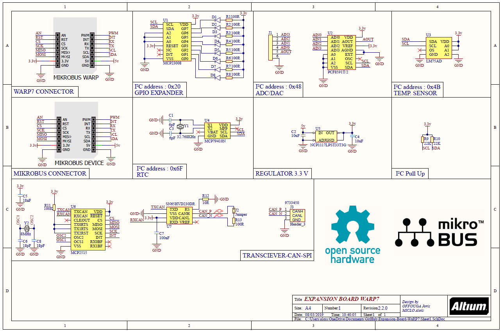

# Expansion-Board-WaRP7

Developpement Board for WaRP7 : 

Temp sensor : [LM75AD](http://www.farnell.com/datasheets/693899.pdf?_ga=2.40871586.1424183435.1530616101-1058111146.1526763788&_gac=1.61143518.1530616101.Cj0KCQjwvezZBRDkARIsADKQyPk_MUB1jLtsuJfhomTjovvrmCVe17g2e4NFPh25Ppu5gE2iyfi11lsaAmzCEALw_wcB)

RTC : [MCP7940N](http://www.farnell.com/datasheets/2129560.pdf?_ga=2.42239269.1424183435.1530616101-1058111146.1526763788&_gac=1.57005144.1530616101.Cj0KCQjwvezZBRDkARIsADKQyPk_MUB1jLtsuJfhomTjovvrmCVe17g2e4NFPh25Ppu5gE2iyfi11lsaAmzCEALw_wcB) 

ADC/DAC : [PCF8591](http://www.farnell.com/datasheets/1759207.pdf?_ga=2.48007463.1424183435.1530616101-1058111146.1526763788&_gac=1.220535018.1530616101.Cj0KCQjwvezZBRDkARIsADKQyPk_MUB1jLtsuJfhomTjovvrmCVe17g2e4NFPh25Ppu5gE2iyfi11lsaAmzCEALw_wcB)

GPIO Expander : [MCP2308](http://www.farnell.com/datasheets/12174.pdf?_ga=2.40871586.1424183435.1530616101-1058111146.1526763788&_gac=1.61143518.1530616101.Cj0KCQjwvezZBRDkARIsADKQyPk_MUB1jLtsuJfhomTjovvrmCVe17g2e4NFPh25Ppu5gE2iyfi11lsaAmzCEALw_wcB) 

Transceiver CAN-SPI : [MCP2515](http://www.farnell.com/datasheets/1669372.pdf?_ga=2.122110219.1424183435.1530616101-1058111146.1526763788&_gac=1.115744244.1530616101.Cj0KCQjwvezZBRDkARIsADKQyPk_MUB1jLtsuJfhomTjovvrmCVe17g2e4NFPh25Ppu5gE2iyfi11lsaAmzCEALw_wcB)

[Socket Mikrobus](https://www.mikroe.com/mikrobus)

